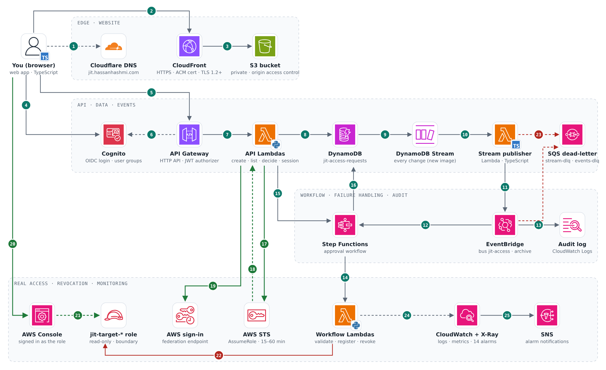
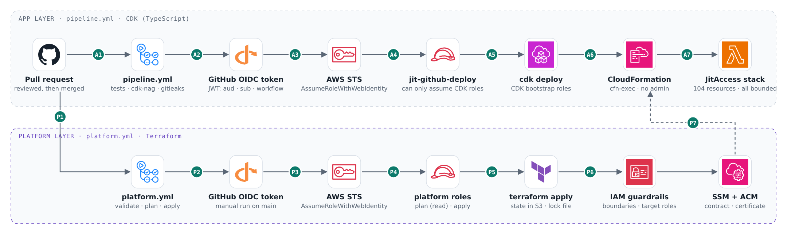

# JIT Access

Temporary AWS access, approved by someone else and taken away automatically.

Engineers often keep standing admin or production access "just in case". This project replaces that with
just-in-time access: you ask for a specific kind of access, for a reason and a fixed time, a different person
approves it, you get a real AWS console session for that window only, and it's revoked when time is up.
Every step is audited.

**Live:** https://jit.hassanhashmi.com (demo users only)

## What it does

| Access | Gives you | Max | Extra rule |
|---|---|---|---|
| `prod-logs-read` | Read this app's CloudWatch Logs | 240 min | |
| `prod-db-readonly` | Read the requests table in DynamoDB | 120 min | |
| `prod-breakglass-admin` | Read-only across the account (kept read-only in this demo) | 60 min | Reason must include an incident number like `INC-123`, otherwise it's rejected automatically |

1. Sign in with Cognito (OpenID Connect, authorization code + PKCE).
2. Request access. The workflow checks policy, then waits for an approver.
3. An approver (never the requester) approves or rejects.
4. Once granted, **Open AWS console** gives you a real, time-limited session in a read-only target role.
5. At expiry the workflow marks the request revoked and cuts off any sessions that are still open.

## Architecture



- **Edge (1–3):** the browser looks up `jit.hassanhashmi.com` in Cloudflare DNS, then connects straight to
  CloudFront, which serves the app from a private S3 bucket with an ACM certificate (TLS 1.2+).
- **Authentication (4–6):** Cognito issues tokens; API Gateway's JWT authorizer checks signature, issuer,
  client, expiry and scope before any code runs. A bad token gets a 401.
- **Authorization (7):** the Python Lambdas decide what you may do: only requesters create requests, only
  approvers see the queue and decide, nobody approves their own request, only the requester can open the
  console. Otherwise 403.
- **Events (8–13):** requests are saved in DynamoDB with conditional writes. The stream feeds a TypeScript
  Lambda that publishes to an EventBridge bus; rules start the workflow and copy every event to an audit log.
- **Workflow (14–16):** Step Functions validates policy, pauses on a task token until an approver decides,
  grants, waits until expiry and revokes, with retries and a catch on every step.
- **Real access (17–21):** the start-session Lambda calls STS AssumeRole on a `jit-target-*` role with the
  user's name as `SourceIdentity`, gets temporary credentials back, and swaps them at the AWS sign-in
  (federation) endpoint for a one-time link. The browser opens it and lands in the AWS console, signed in as
  that read-only role.
- **Revocation (22):** at expiry a revoker adds a deny to the role for that user's older sessions, so open
  consoles stop within seconds.
- **Failures and monitoring (23–25):** anything that still fails after retries lands in an SQS dead-letter
  queue. Logs and metrics go to CloudWatch (14 alarms notify through SNS); traces go to X-Ray.

## How changes reach AWS



There are no AWS access keys in GitHub. Each workflow gets short-lived credentials through OIDC, and each AWS
role trusts exactly one workflow file on one trigger.

| Workflow | Runs on | What it does |
|---|---|---|
| `pipeline.yml` | Changes outside `platform/` | Tests, cdk-nag synth and secret scan with no AWS access; on `main` it deploys the app with CDK through the `jit-github-deploy` role |
| `platform.yml` | Changes to `platform/`, manual runs | fmt, validate, checkov and gitleaks; a read-only plan on pull requests; apply only on a manual run on `main` where someone types `apply` |

The OIDC trust checks `aud`, the `sub` claim with the repository's immutable IDs (so a recreated repo with the
same name can't inherit it) and `job_workflow_ref`.

## Security guardrails

- **Permission boundaries.** CDK's default admin execution role is replaced: CloudFormation can only create
  IAM roles that carry the platform's boundary, and can never remove or edit it. A test fails if any role in
  the stack is missing the boundary.
- **Least privilege per function.** One role per Lambda with exact actions. Only the broker can assume roles
  (only `jit-target-*`), and only the revoker can write IAM (only `iam:PutRolePolicy` on `jit-target-*`).
- **Read-only target roles.** Every `jit-target-*` role is capped by a `ReadOnlyAccess` boundary, whatever
  policy is attached to it.
- **Compliance checks in CI.** cdk-nag and checkov run on every change; every accepted finding has a written reason.

## Repository layout

| Path | What | Tool |
|---|---|---|
| `platform/` | OIDC roles, permission boundaries, JIT target roles, ACM certificate, SSM parameters | Terraform |
| `app/lib/` | Cognito, API Gateway, Lambdas, DynamoDB, EventBridge, Step Functions, S3/CloudFront, alarms | AWS CDK (TypeScript) |
| `app/lambdas/python/` | API and workflow Lambdas, with unit tests | Python 3.12 |
| `app/lambdas/ts/` | DynamoDB Stream to EventBridge publisher | TypeScript |
| `web/` | Browser app | TypeScript, Vite |
| `.claude/` | AI assistant setup: rules, skills, reviewer agent, guard hooks | Claude Code |

Terraform owns the platform layer, which changes rarely and is security-reviewed. CDK owns the application,
which changes often. They share values (boundary ARN, domain, certificate) through SSM parameters under
`/jit/platform/`, so neither side hard-codes the other.

## Running the checks locally

None of these need AWS credentials.

```bash
# Python Lambdas
cd app/lambdas/python && python3 -m venv .venv && .venv/bin/pip install -r requirements-dev.txt
.venv/bin/ruff check . && .venv/bin/pytest -q

# CDK app: lint, types, infrastructure tests, synth with cdk-nag
cd app && npm ci && npm run lint && npm run build && npm test && npx cdk synth --quiet

# Web app
cd web && npm ci && npm run build

# Terraform
cd platform && terraform fmt -check -recursive && terraform init -backend=false && terraform validate
```

## Working with AI on this repo

The repo is set up for Claude Code, so the assistant works the same way a teammate would:

- `CLAUDE.md` and `.claude/rules/` describe the architecture, commands and the rules that can't be broken,
  per area (Python, CDK, Terraform, IAM, GitHub Actions).
- Skills in `.claude/skills/` are repeatable procedures: `add-access-role`, `add-lambda`, `iam-review`,
  `triage-request` and `verify`.
- A read-only `security-reviewer` agent reviews changes it didn't write.
- Hooks in `.claude/hooks/` are enforced, not advice: they block deploys, Terraform applies, pushes to `main`,
  AWS writes and secrets in files, and lint every edit.

## Design choices, briefly

- **Serverless** because the load is small and spiky, and it costs almost nothing when idle.
- **EventBridge** so the table doesn't need to know who's listening; new consumers are one rule away.
- **Step Functions (Standard)** for long human and timer waits with retries, catches and 90 days of history.
- **DynamoDB** because the access patterns are simple and it has streams built in.
- **No VPC** because nothing here needs private networking; everything talks to AWS APIs.
- **Revocation by `aws:TokenIssueTime`** because STS credentials can't be cancelled one by one.

In a larger setup: separate dev and prod accounts under Control Tower, the OIDC roles rolled out with
StackSets, an SCP as the outer fence, and IAM Identity Center permission sets instead of target roles.
